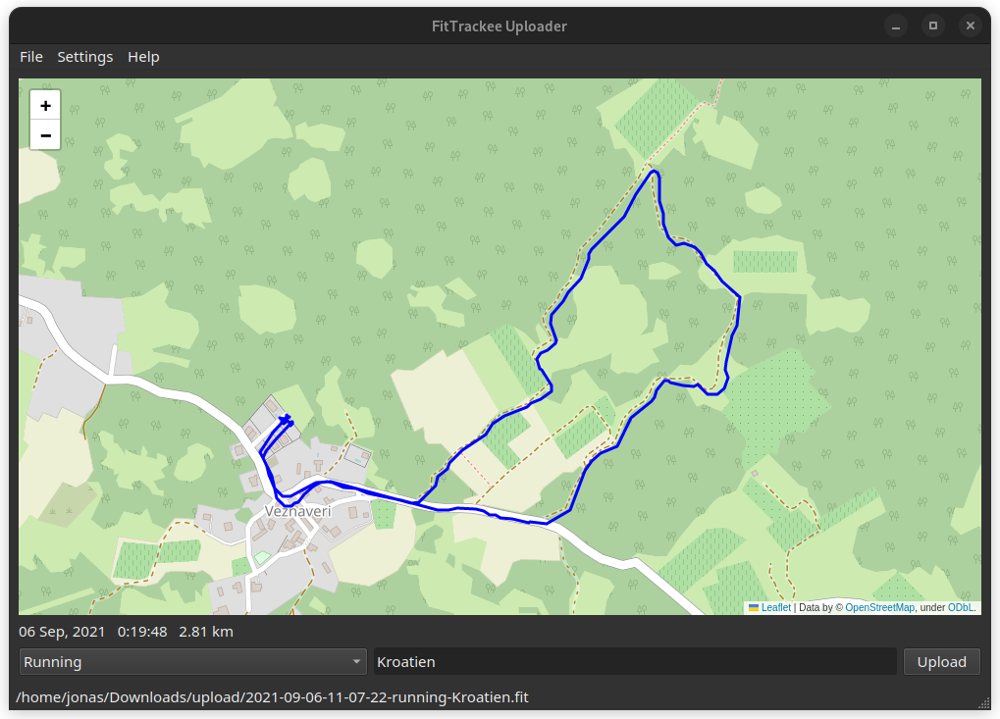

# FitTrackee Uploader

**A companion application for [FitTrackee](https://samr1.github.io/FitTrackee/) to upload your workout files**

With this application you can easily upload your workouts to your FitTrackee instance. Just set a source folder where
you store your workouts, and it will show you the track and some basic stats. You can choose a sport type and set a
title and then just hit upload and your file will automatically be converted to a GPX file and uploaded.



## Features

- Upload workout files from a folder, for example your Garmin watch after connecting it
- Move uploaded files to a different folder and optionally add title and sport type to the filename
- Add some basic stats to the description on FitTrackee like calories and average heart rate.
- Allows uploading files that are not compatible with FitTrackee like FIT files

## Supported file types

- FIT
- GPX

## Installation

Clone repository

```sh
git clone https://github.com/ebrithiljonas/fittrackee-uploader.git
```

Install the package and all dependencies

```sh
cd fittrackee-uploader
pip install .
```

If you wish to work on or modify the code base then include the `-e` flag.

## Basic usage

Run the application at the command line with...

```sh
fittrackee-uploader
```

**NB** - If you use the zsh shell and run this from _within_ the cloned repository it will change directory into the
`fittrackee-uploader` sub-directory.

The first time you start it, you'll be asked to enter your fittrackee URL and user login details, then it will log you
in automatically. Then go to _Settings > Options_ and select the local folder where the fit/gpx files are located. These
files will be loaded one by one, so you can select the type of training (run, walk, bike...), give it a title and then
click on the Upload button.

## Current limitations

- Multi-sport files are not supported
